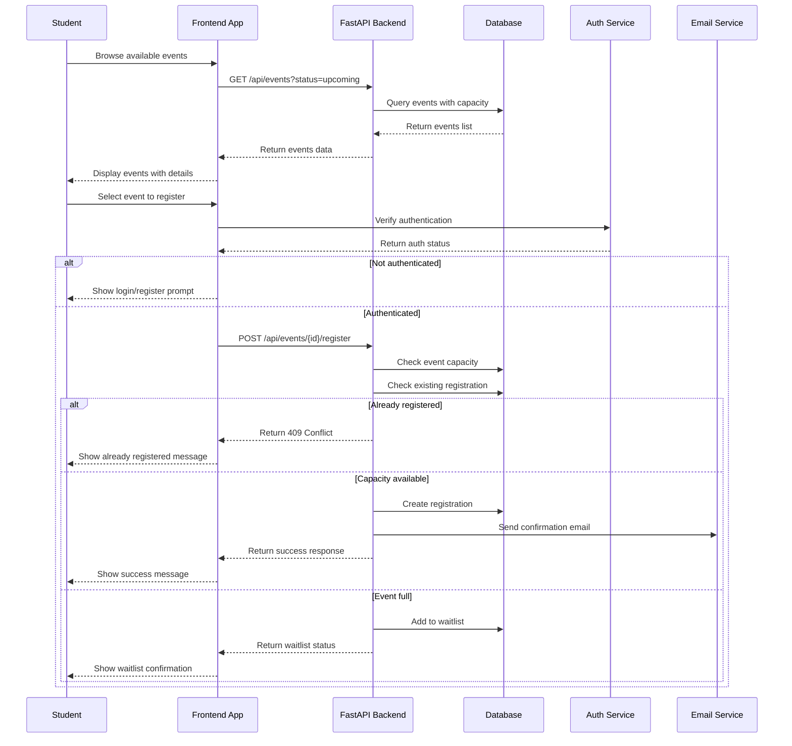
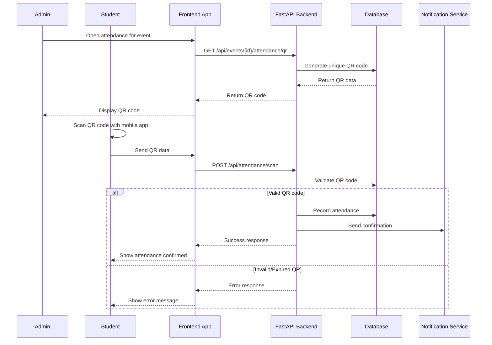
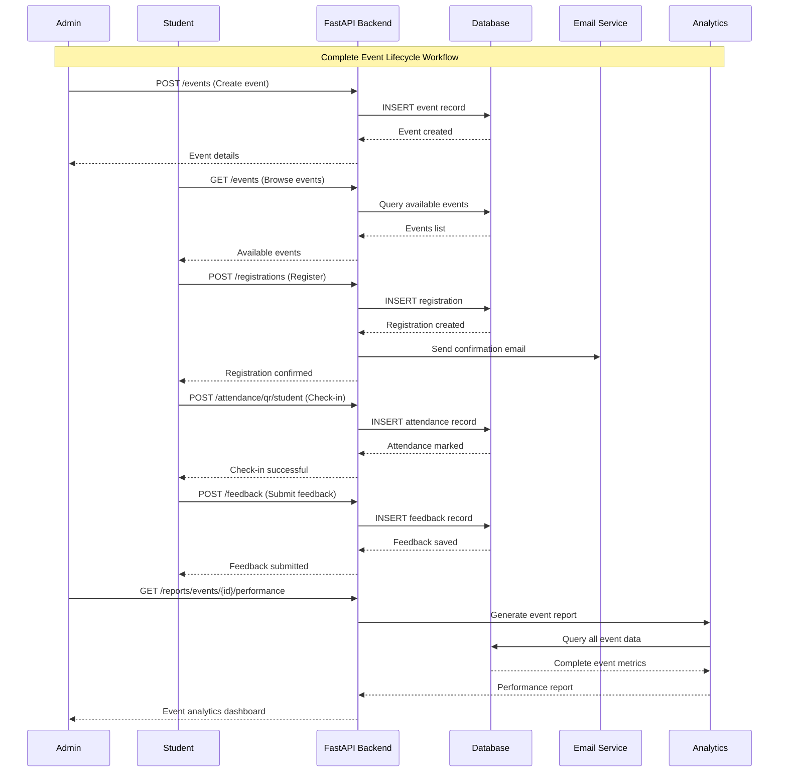
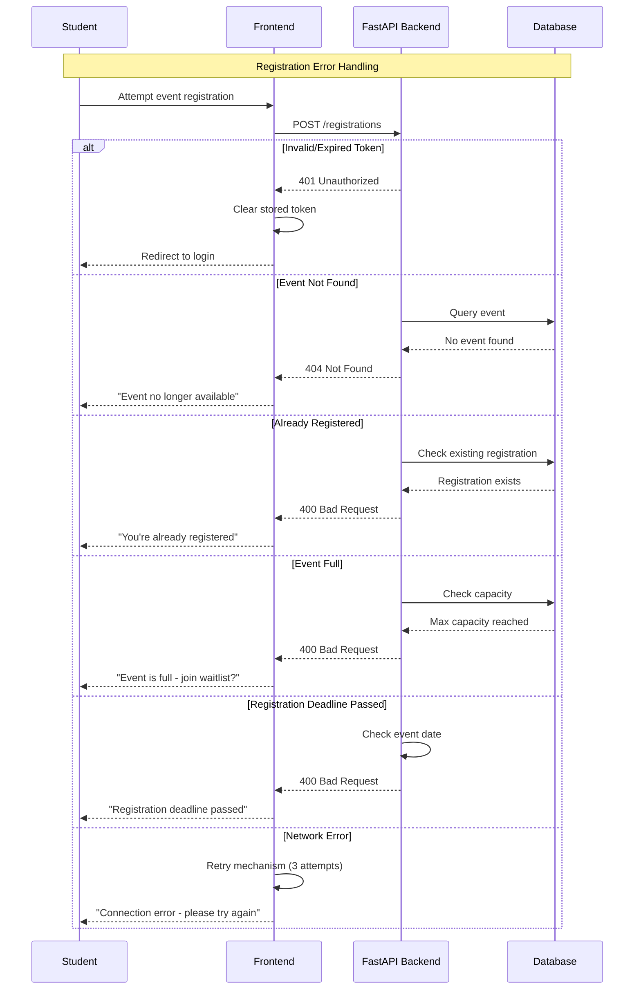

# Campus Event Management System - Workflows

## Overview
This document outlines the key workflows in the Campus Event Management System using sequence diagrams. The workflows cover the complete lifecycle from event registration through attendance tracking to reporting and analytics.

## Table of Contents
- [Student Registration Workflow](#student-registration-workflow)
- [Attendance Tracking Workflow](#attendance-tracking-workflow)
- [Event Management Workflow](#event-management-workflow)
- [Feedback Collection Workflow](#feedback-collection-workflow)
- [Reporting Workflow](#reporting-workflow)
- [Complete End-to-End Workflow](#complete-end-to-end-workflow)
- [Error Handling Workflows](#error-handling-workflows)

---

## Student Registration Workflow

### 📝 Event Registration Process

## Attendance Tracking Workflow

### 🎯 QR Code Attendance Process

## Complete End-to-End Workflow

### 🔄 Full Event Lifecycle

---

## Error Handling Workflows

### ⚠️ Registration Error Scenarios

